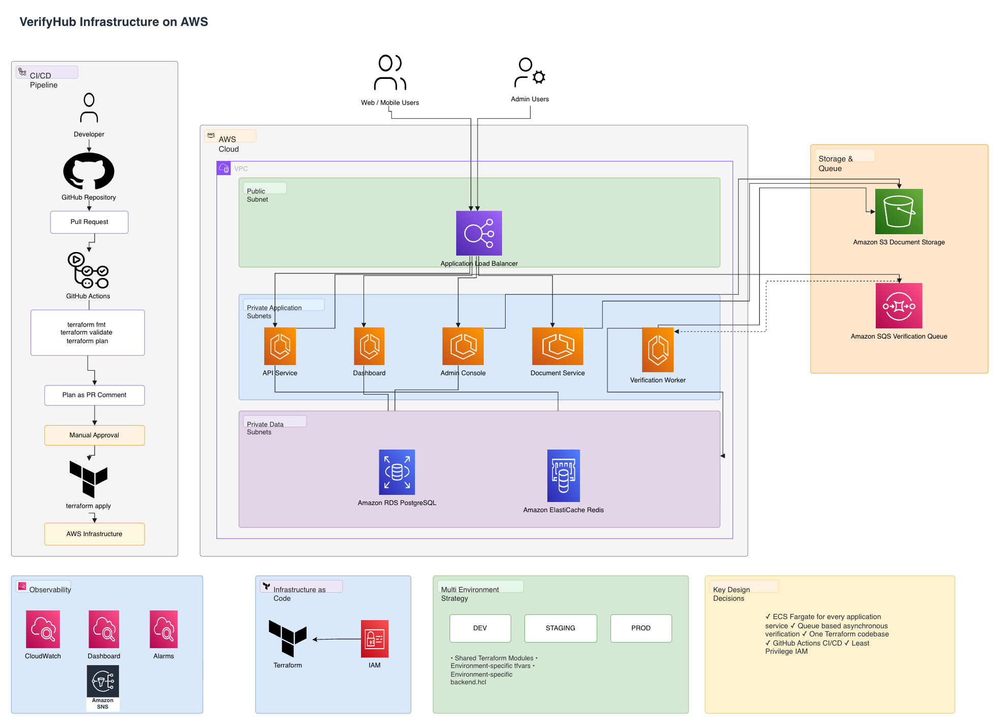

# VerifyHub Infrastructure

Terraform-managed AWS infrastructure for VerifyHub, a B2B KYC verification platform.
Businesses upload an ID document and a selfie; the platform runs checks and returns
a pass/fail with a confidence score.

This repo owns how VerifyHub is built, run, secured, and shipped on AWS. Application
code is out of scope - see app/README.md for a note on the stub used to keep the
Terraform generic against a real container contract (port, health check path, env
vars).

No live deploy is required or maintained for this exercise. Every environment is
verified via terraform fmt -check, terraform validate, and a clean terraform plan
against real AWS provider schemas - see "How to run plan" below.

## High-Level Architecture



## Repo layout

```text
infra/
├── modules/                         Reusable, environment-agnostic building blocks
│   ├── networking/                  VPC, 3-tier subnets (public / private-app / private-data), NAT per AZ
│   ├── ecs-cluster/                 ECS cluster + shared ALB
│   ├── ecs-service/                 Generic Fargate service (task definition, autoscaling)
│   ├── ecr/                         Container repository with scan-on-push and immutable tags
│   ├── rds/                         PostgreSQL, KMS encryption, Secrets Manager credentials
│   ├── s3-document-store/           Encrypted document bucket with lifecycle expiry
│   ├── sqs-queue/                   Verification queue + DLQ
│   ├── elasticache/                 Redis, encrypted at rest and in transit
│   ├── iam/                         Execution role + least-privilege task roles
│   └── observability/               CloudWatch alarms, SNS topic, dashboard
│
├── environments/
│   ├── dev/                         Root module for development
│   ├── staging/                     Staging configuration
│   └── prod/                        Production configuration (multi-AZ, deletion protection)
│
└── global/
    └── state-backend/               Bootstrap S3 backend (Terraform 1.10 native locking)

.github/workflows/
├── plan.yml                         fmt, validate, plan, PR comments
└── apply.yml                        Manual apply (workflow_dispatch)

docs/
└── diagrams/                        Architecture and request-flow diagrams

app/                                 Application stub

DECISIONS.md                         Design decisions, tradeoffs, assumptions, future work
```

## How one environment is wired (dev, staging, prod are identical in structure)

Each environment's main.tf calls, in order: networking -> ecs_cluster -> 5x ecr
-> documents -> queue -> cache -> database -> iam -> 5x ecs-service (one per
VerifyHub component) -> observability. Security groups, ALB target groups, and the
ALB listener/rules are declared directly at the environment root (not inside a
module) specifically to avoid a circular dependency between the ALB listener and the
ECS services that register with it - see DECISIONS.md for why.

## Adding a new environment or region

A new environment is a new folder under infra/environments/ containing only
main.tf (identical across all three today), variables.tf, terraform.tfvars
(env-specific values), and backend.hcl (env-specific state key). No module code
changes. Region is parameterized via var.aws_region; see DECISIONS.md for what
would need to change (AZ names are currently hardcoded per-environment tfvars, not
data-sourced) before a new region is fully zero-touch.

## Prerequisites

- Terraform >= 1.10 (uses native S3 state locking, no DynamoDB table)
- AWS CLI configured with credentials for the target account
- For CI: GitHub Secrets AWS_ACCESS_KEY_ID / AWS_SECRET_ACCESS_KEY (see
  DECISIONS.md for the OIDC improvement this should move to)

## How to run terraform plan per environment

One-time, per AWS account (creates the shared state bucket):

    cd infra/global/state-backend
    terraform init
    terraform plan -var="account_alias=<unique-suffix>"
    terraform apply -var="account_alias=<unique-suffix>"

Then, for each environment:

    cd infra/environments/dev        # or staging, or prod
    terraform init -backend-config=backend.hcl
    terraform fmt -check -recursive
    terraform validate
    terraform plan -var-file=terraform.tfvars

Same three commands for staging and prod - only the directory changes, nothing else.

## Delivery flow

1. Open a PR touching infra/** - GitHub Actions runs fmt -check, validate, and
   plan for dev, staging, and prod, posting each plan as a PR comment.
2. A human reviews the plan output alongside the code diff, approves, merges.
3. apply.yml is manual-trigger only (workflow_dispatch), reflecting that live
   deploy isn't required for this exercise while keeping the actual apply pipeline
   fully codified and reviewable, exactly as it would run in a real rollout.

## Security design, in one paragraph

Three-tier subnets (public / private-app / private-data, data tier has no internet
route at all). Least-privilege IAM: one task role per service, each scoped to only
the resource ARNs that service actually touches (e.g. the dashboard can read the DB
but never touches S3 or the queue). All secrets in Secrets Manager, never in tfvars.
KMS encryption on RDS, S3, and Secrets Manager. ECR scan-on-push with immutable
tags. Single AWS account for all three environments today, isolated by VPC/state/IAM
boundaries rather than account boundaries - the detailed reasoning for that tradeoff,
and what would change with more time, is in DECISIONS.md.

## Observability

Three SLOs (API availability, verification job completion time, API p95 latency),
each with a CloudWatch alarm wired directly to it, plus DLQ depth, RDS health, and
per-service CPU alarms - all feeding one SNS topic. A CloudWatch dashboard gives a
single at-a-glance view. Full reasoning for each SLO's target number is in
DECISIONS.md.

## Status

All three environments (dev, staging, prod) pass fmt -check, validate, and
produce a clean terraform plan with zero errors. dev and staging were additionally
applied live against a personal AWS account during development (not required by the
brief) to stress-test the code beyond static checks - this caught a real ALB
listener race condition and a free-tier RDS limit that plan-only review would have
missed. All live resources have since been destroyed; only the code remains, per the
assignment's "no live deploy required" scope.
